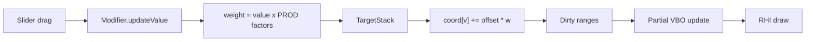

# Documentation Standards

**Version:** 1.0 · **Created:** 2026-08-29

How this project documents itself so it stays understandable, scalable, and
transferable — to a new contributor, or to an agent starting a fresh session.

---

## 1. Principles

1. **Documentation-first for interfaces.** Write the header and its doc comment
   before the implementation. If the doc is hard to write, the interface is wrong.
2. **Document *why*, not *what*.** The code says what. Comments say why this way,
   what was rejected, and what breaks if you change it.
3. **Every factual claim is verifiable.** Cite `file:line` or the command that
   produced the number. Never document behaviour from memory.
4. **Docs live with the code and change in the same commit.** A doc updated later
   is a doc that is already wrong.
5. **Stale beats missing is FALSE.** A wrong doc lies with authority. Delete it
   rather than leave it stale.
6. **Write for someone who has never seen this codebase.** Define jargon on first
   use. "Proxy" means something specific here; say so.

## 2. The documentation layers

| Layer | Location | Audience | Updated |
|---|---|---|---|
| **Memory** | `memory/*.md` | Agents + maintainers resuming work | Every session |
| **Architecture** | `memory/architecture.md`, `mindmap.md` | Anyone changing structure | Every structural change |
| **API reference** | Doxygen from headers → `docs/api/` | Library consumers | Generated on build |
| **Guides** | `docs/guides/*.md` | New contributors, users | On feature change |
| **Formats** | `docs/formats/*.md` | Importer/exporter authors | On format change |
| **ADRs** | `docs/adr/NNNN-*.md` | Future maintainers asking "why?" | On each significant decision |
| **Changelog** | `CHANGELOG.md` | Users | Every release |
| **Licensing** | `LICENSING.md` | Legal, redistributors | Every dependency/asset change |

## 3. Code documentation

### 3.1 Public headers — Doxygen

```cpp
/// Applies the full modifier stack to the base mesh.
///
/// Resets every vertex to its original position, then applies each target in
/// @p stack at its recorded weight. Application is additive and order-independent
/// because each target contributes a sparse offset:
///
///     coord[verts[i]] += data[i] * weight
///
/// @param stack   Target paths mapped to weights. Zero-weight entries must be
///                absent — the reference deletes them
///                (legacy/python/apps/human.py:920-921) and callers rely on it.
/// @param out     Destination, resized to the base mesh vertex count.
/// @return        Number of vertices actually modified, for dirty-range tracking.
///
/// @note Thread-safe with respect to @p stack; @p out must not be shared.
/// @see  memory/architecture.md §I.3 for the reference behaviour this matches.
[[nodiscard]] uint32_t applyStack(const TargetStack& stack, std::span<Vec3> out) const;
```

Required tags on every public entity: a one-line summary, `@param` for each
parameter, `@return` when non-void, `@note` for threading or lifetime constraints.

### 3.2 Implementation comments

Comment the non-obvious only. Specifically **do** comment:

- **Why a non-obvious approach was chosen** and what was rejected.
- **Reference-behaviour matching**, with the citation:
  ```cpp
  // Quantised to int16 * 1e-3 to match the compiled-target format
  // (legacy/python/core/algos3d.py:221). Widening this breaks .npz compatibility.
  ```
- **Deliberate simplifications**, naming the ceiling and the upgrade path:
  ```cpp
  // ponytail: linear scan over 163 bones. Fine at this size; index by name
  // if a rig ever exceeds ~1k bones.
  ```
- **Known-broken reference behaviour we deliberately do NOT match**, citing
  `project_context.md` §8.
- **Units and coordinate conventions** at every boundary. This codebase is
  decimetres, Y-up, +Z-facing, row-major with column vectors, quaternions `[w,x,y,z]`.
  Say so wherever data crosses in or out.

Do **not** comment what the code plainly states. `// increment i` is noise.

## 4. Architecture Decision Records

One file per significant decision: `docs/adr/0001-use-qt-rhi.md`.

```markdown
# ADR 0001 — Use Qt RHI rather than direct Metal

Date: 2026-08-29
Status: Accepted            (Proposed | Accepted | Superseded by ADR-NNNN | Deprecated)

## Context
OpenGL is deprecated on macOS and capped at 4.1. The Python reference uses the
fixed-function pipeline with client-side vertex arrays and needs nothing above
GL 2.1 (verified: no glGenBuffers anywhere in legacy/python/lib/glmodule.py).
We must choose a modern graphics backend.

## Decision
Use Qt RHI with the Metal backend on macOS.

## Consequences
+ Ships with Qt 6; no extra dependency.
+ qsb bakes shaders once for Metal/Vulkan/D3D12 — keeps Windows/Linux open.
+ Integrates with QRhiWidget, so the viewport is a normal widget.
- One abstraction layer away from Metal; compute-shader morphing needs checking.
- Depth range differs from GL (z in [0,1] not [-1,1]) — lib/matrix.py:60-92
  must be reworked, not transliterated.

## Alternatives considered
- Direct Metal: maximum control, but macOS-only and much more code.
- bgfx: capable, but a third-party dependency duplicating what Qt already ships.
```

Write an ADR when a decision is expensive to reverse, surprising to a newcomer,
or was contested. Not for routine choices.

## 5. Format documentation

Every file format we read or write gets `docs/formats/<format>.md`:

1. **Purpose and provenance** — what it is, who defined it, spec URL, version.
2. **Grammar** — the complete key/section list. No "and so on".
3. **A real annotated example** from `data/`.
4. **Semantics** — units, coordinate system, index bases, defaults for absent keys.
5. **Our support matrix** — what we read, what we write, what we deliberately drop.
6. **Compatibility notes** — which DCCs were *tested*, at what version.
7. **Known issues in the reference implementation**, cited.

This matters disproportionately here: `.mhm`, `.mhclo`, `.mhmat`, `.mhskel`,
`.target`, `.mhw`, `.mhpose` have **no specification anywhere** — the Python source
is the only definition. Writing these documents is how that knowledge stops being
locked in `legacy/python/`.

## 6. Diagrams

Mermaid, inline in Markdown, so diagrams version and diff as text.



Use a diagram when structure or flow is the point. Never a diagram that only
restates a list. Every diagram carries a caption naming what it shows and what it
deliberately omits.

## 7. Changelog

Keep-a-Changelog format, SemVer. Grouped `Added / Changed / Deprecated / Removed /
Fixed / Security`. Written for users, not committers: "FBX export now writes
correct units at every scale" — not "fix scale_factor".

Every entry that fixes reference behaviour notes the difference explicitly, because
output will change for existing users.

## 8. Version awareness

Every document carries `**Version:**` and `**Created:**`/`**Updated:**`. Any
document making claims about the reference implementation also names the commit it
was verified against. Format docs carry the format version they describe.

When a doc is superseded, mark it `Status: Superseded by <path>` and keep it —
history explains why things are the way they are.

## 9. What NOT to document

- Anything the code says plainly.
- Anything a fresh session can derive in a few tool calls: directory listings,
  dependency lists already in `CMakeLists.txt`, standard build invocations.
- Generic best practice the reader already knows.
- Aspirational behaviour. Document what **is**. Plans go in `todo.md`.

`legacy/python/core/files3d.py:41-64` is the cautionary example: its docstring
promises "a range of functions to handle most common 3D file formats" and the
module reads exactly one — OBJ. Aspirational documentation is a lie with a
timestamp.

## 10. Review checklist

- [ ] Every factual claim cites `file:line` or a command
- [ ] Jargon defined on first use
- [ ] Units and coordinate conventions stated at boundaries
- [ ] Examples are real and were run
- [ ] No aspirational statements
- [ ] Version and date present
- [ ] Updated in the same commit as the code
