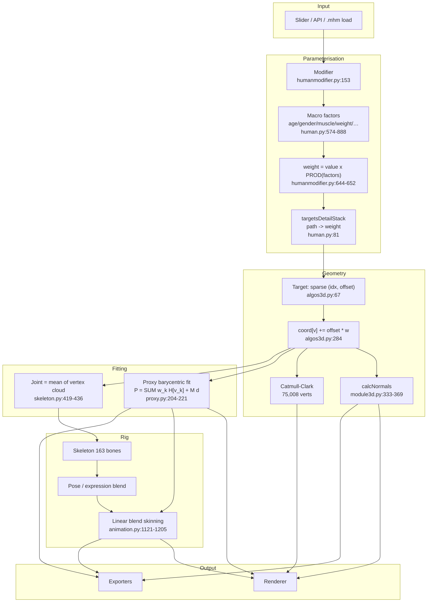
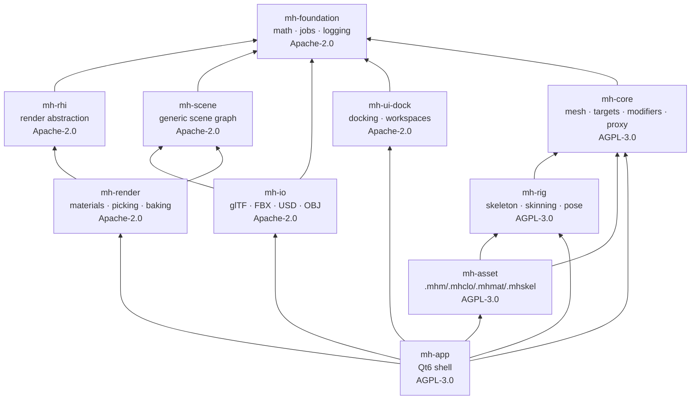

# System Mindmap

**Version:** 1.0 · **Created:** 2026-08-29

High-level map of how everything connects. Read this before changing an interface.
Backed by the knowledge graph in `graphify-out/` (5,392 nodes · 9,319 edges ·
358 communities, built 2026-08-29).

---

## 1. The one-paragraph model

A **base mesh** (19,158 quad-vertices, CC0) is deformed by a weighted stack of
**sparse morph targets**. **Modifiers** map user-facing sliders onto target
weights via a product-of-factors rule. **Proxies** (clothes, hair, eyes) are
fitted to the deformed body barycentrically. A **skeleton** derives its joint
positions from the deformed mesh, so the rig follows the body. **Skinning** poses
everything. **Exporters** flatten the result to a file. That is the whole system.

## 2. Data flow — the critical path



**The load-bearing insight:** the mesh is the *source of truth* for the rig, not
the other way round. Change a slider → vertices move → joint positions move →
bone rest matrices rebuild. This is why `applyAllTargets` also calls
`updateJoints` and `resetBakedAnimations` (`legacy/python/apps/human.py:1177-1180`).
A port that treats the skeleton as independent will drift.

## 3. Module dependency graph (C++ target design)



**Arrows point to dependencies.** AGPL modules may depend on Apache-2.0 modules;
**never the reverse**. `mh-core` deliberately does not link Qt, so headless
character generation (Objective O6) stays possible.

## 4. Subsystem neighbours — who breaks when you change what

| If you change… | You must check… | Because |
|---|---|---|
| `Mesh` vertex layout | renderer buffers, proxy fit, exporters, subdivision, targets | Everything indexes into `coord` |
| Target format | asset compiler, `.mhm` load, modifier weights, custom user targets | Users have their own `.target` files |
| Modifier weighting | every saved `.mhm`, all parity fixtures | Weight changes silently alter every character |
| Joint vertex mapping | skeleton rest matrices, all skinning, all exports | Joints derive from mesh vertices |
| Proxy fit math | clothes, hair, eyes, eyelashes, teeth, tongue, topologies | One code path, seven asset types |
| Coordinate convention | **every** exporter and importer | dm / Y-up / +Z / row-major-column-vector |
| `.mhmat` keys | material editor, all exporters, shader binding | Binding is by *name* |
| Shader define set | the `path@DEF1|DEF2` variant cache key | Community `.mhmat` files reference defines by name |
| Dock/workspace schema | saved user workspaces | Needs a version + graceful fallback |

## 5. The seven data formats and who owns them

| Format | What | Owner module | Spec exists? |
|---|---|---|---|
| `.mhm` | Saved character: version, modifiers, proxies by **UUID**, materials, skeleton, pose | `mh-asset` | ❌ source only |
| `.target` | Sparse morph: `idx dx dy dz` per line | `mh-core` | ❌ |
| `.mhclo` / `.proxy` | Proxy fit: barycentric refs + offsets + delete mask | `mh-asset` | ❌ |
| `.mhmat` | Material: colours, 7 texture channels, shader config | `mh-asset` | ❌ |
| `.mhskel` | Rig: JSON, bones + joints + planes | `mh-rig` | ❌ |
| `.mhw` / `.jsonw` | Vertex bone weights, JSON | `mh-rig` | ❌ |
| `.mhpose` | Expression: unit-pose name → weight | `mh-rig` | ❌ |

**None of these have a written specification.** Producing `docs/formats/*.md` is
therefore a first-class deliverable, not documentation polish — see `docs.md` §5.

## 6. Where the time goes (measured 2026-08-29)

```
Cold OBJ load        ████████████████████████████  211.8 ms   ← _update_faces Python loops
Catmull-Clark build  ███████████████████████████   202.3 ms
Load 1,280 targets   ██████████████████████████████ ~670 ms   ← ASCII parse
Subdiv calcNormals   ███                            20.6 ms   ← blows the 16.6 ms frame budget
Subdiv update_coords █                               7.6 ms
calcNormals base     ▌                               5.2 ms
Apply 200 targets    ▌                               4.8 ms
updateIndexBuffer    ▍                               3.4 ms
Apply 1 target       ·                               0.04 ms
```

Plus, per frame and unmeasured here: full vertex-array re-upload (no VBOs),
a second full scene render for picking, an `os.stat` per texture, and a full
bounding-box recompute. See `architecture.md` §I.9.

## 7. Entry points for a new contributor

| Goal | Start here |
|---|---|
| Understand the whole thing | this file, then `architecture.md` |
| Understand modifiers | `architecture.md` §I.4, then `legacy/python/apps/humanmodifier.py:644` |
| Understand the mesh | `architecture.md` §I.2, then `legacy/python/core/module3d.py:110` |
| Add a file format | `instruction.md` §6.2, `architecture.md` §II.5 |
| Work on the UI | `design.md`, then `architecture.md` §II.6 |
| Understand licensing | `project_context.md` §4, then `/LICENSING.md` |
| Ask the graph a question | `graphify query "<question>"` |

## 8. Terminology

| Term | Meaning here |
|---|---|
| **Target** | A sparse morph: a list of vertex indices and 3D offsets |
| **Modifier** | A slider that maps a value onto weights for one or more targets |
| **Macro** | A high-level parameter (age, gender, muscle…) that factors into many targets |
| **Proxy** | Any mesh fitted to the body: clothes, hair, eyes, and alternate topologies |
| **Topology / Proxymesh** | A proxy that *replaces* the body mesh at a different density |
| **Helper geometry** | Non-rendered mesh used to fit proxies and locate joints |
| **Face group** | A named subset of faces; 172 on the base mesh; the picking unit |
| **Pose unit** | One named facial movement; expressions are weighted blends of 60 of them |
| **Seed mesh** | The unsubdivided mesh; the subdivided one is derived and cached |
